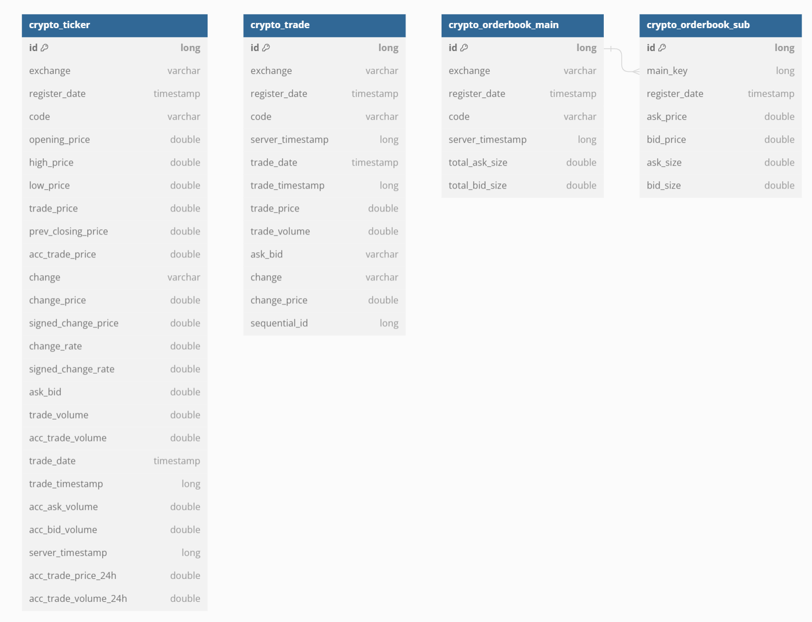

# ERD

```
// https://dbdiagram.io/d

Table crypto_ticker{
    id long [primary key]   
    exchange varchar        // 거래소
    register_date timestamp     // 테이블 입력 시간
    code varchar            // 종목 코드
    opening_price double        // 시가
    high_price double       // 고가
    low_price double        // 저가
    trade_price double      // 현재가
    prev_closing_price double   // 전일 종가
    acc_trade_price double      // 누적 거래대금. UTC 0시 기준.
    change varchar          // 전일 대비 - RISE 상승 / EVEN 보합 / FALL 하락
    change_price double     // 부호 없는 전일 대비 값
    signed_change_price double  // 전일 대비 값
    change_rate double      // 부호 없는 전일 대비 등락율
    signed_change_rate double   // 전일 대비 등락율
    ask_bid double          // 매도/매도 구분 - ASK 매도 / BID 매수
    trade_volume double     // 가장 최근 거래량
    acc_trade_volume double     // 누적 거래량. UTC 0시 기준.
    trade_date timestamp        // 최근 거래 일자(UTC) yyyy-MM-dd HH:mm:ss
    trade_timestamp long        // 체결 타임스탬프 (milliseconds)
    acc_ask_volume double       // 누적 매도량
    acc_bid_volume double       // 누적 매수량
    server_timestamp long       // 타임스탬프 (millisecond) 거래소 서버 시간
    acc_trade_price_24h double  // 24시간 누적 거래대금
    acc_trade_volume_24h double // 24시간 누적 거래량
}

Table crypto_trade {
    id long [primary key]
    exchange varchar        // 거래소
    register_date timestamp     // 테이블 입력 시간
    code varchar            // 종목 코드
    server_timestamp long       // 타임스탬프 (millisecond) 거래소 서버 시간
    trade_date timestamp        // 체결 일자(UTC 기준) yyyy-MM-dd HH:mm:ss
    trade_timestamp long        // 체결 타임스탬프 (millisecond)
    trade_price double      // 체결 가격
    trade_volume double     // 체결량
    ask_bid varchar         // 매도/매도 구분 - ASK 매도 / BID 매수
    change varchar          // 전일 대비 - RISE 상승 / EVEN 보합 / FALL 하락
    change_price double     // 부호 없는 전일 대비 값
    sequential_id long      // 체결 번호 (Unique) - 체결의 유일성 판단을 위한 근거. 하지만 체결의 순서를 보장하지는 못함.

}

Table crypto_orderbook_main {
    id long [primary key]
    exchange varchar        // 거래소
    register_date timestamp     // 테이블 입력 시간
    code varchar            // 종목 코드
    server_timestamp long       // 타임스탬프 (millisecond) 거래소 서버 시간
    total_ask_size double       // 호가 매도 총 잔량
    total_bid_size double       // 호가 매수 총 잔량
}

Table crypto_orderbook_sub {
    id long [primary key]
    main_key long           // FK. crypto_orderbook_main.id
    register_date timestamp     // 테이블 입력 시간
    ask_price double        // 매도 호가
    bid_price double        // 매수 호가
    ask_size double         // 매도 잔량
    bid_size double         // 매수 잔량
}


Ref: crypto_orderbook_sub.main_key > crypto_orderbook_main.id
```

